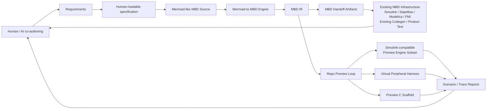
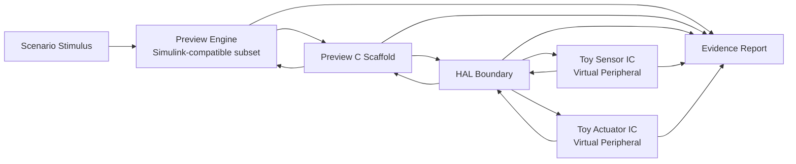

# Requirements: AI-Assisted MBD Workflow Validation

This document defines the fictional validation target for the next project goal.
It is a requirements baseline, not a hardware datasheet, safety case, or ASPICE
compliance claim.

## Objective

Build a fictional but engineering-shaped validation example that demonstrates
MBD as the intermediate language for AI-assisted development.

Human and AI authors shall start from readable requirements and Mermaid-like MBD
Markdown. The repository shall convert that source through a Mermaid-to-MBD
engine into MBD IR, then generate handoff artifacts for existing MBD
infrastructure.

MBD and later production-grade workflows are expected to use existing
infrastructure such as Simulink, Stateflow, Modelica, FMI, existing MBD
code-generation, and existing product-test processes.

For MVP, CI, and AI feedback loops, this repository shall also provide a
simplified Simulink-compatible preview engine, preview C scaffold, virtual
peripheral harness, scenarios, and reports. These local pieces exist so
AI-generated changes can be checked before handoff; they are not production
verification or certified code-generation backends.

The business-shaped workflow is:

```text
requirements
  -> human-readable specification
  -> Mermaid-like MBD source
  -> Mermaid-to-MBD engine
  -> MBD IR
      -> existing MBD infrastructure handoff
      -> preview engine + harness + preview C + reports
```

## Core Claim

This repository does not primarily prove that AI can write C code directly. It
proves that Mermaid-like authoring and MBD IR can act as shared intermediate
representations so AI can keep requirements, MBD artifacts, harness behavior,
preview C scaffolds, and reports synchronized with lower review cost.

## Workflow Overview

The intended process is not a simple waterfall. Requirements, MBD source,
harness scenarios, generated preview code, and reports form an AI-assisted
feedback loop before external MBD and product-test handoff.



## Harness Boundary

The harness is not a shortcut around MBD verification. It is a preview evidence
layer that connects MBD IR, generated preview C, virtual peripherals, and
scenarios before external MBD/product-test handoff.



## Process Stance

- Use a requirements-first PDCA/TDD loop: write or revise requirements, add
  failing tests or acceptance checks, implement the smallest matching slice,
  regenerate artifacts, then review reports.
- Use ASPICE-aware habits where they help: stable requirement IDs,
  bidirectional traceability, reviewable work products, verification evidence,
  and explicit separation of system, software, harness, and tool artifacts.
- Do not claim ASPICE compliance, safety certification, production readiness,
  or tool qualification from this MVP.

## Fictional Scope

The example system should evolve from `Toy Thermal Fan Control System` into
`Toy Thermal Protection Controller`.

Fictional components:

- `ToyTempSensorIC`
- `ToyFanDriverIC`
- `ToyLoadLimiterIC`
- `ToyThermalProtectionController`

The components, registers, signals, thresholds, and scenarios must remain
invented. They must not resemble a real IC datasheet, production ECU
requirement, confidential product, or vendor-specific implementation.

Use a fictional safety-class-like scheme to express requirement rigor without
claiming ISO 26262 or ASIL compliance:

| Class | Meaning |
| --- | --- |
| `DSC-QM` | Normal quality or convenience behavior |
| `DSC-A` | Minor protection or diagnostic behavior |
| `DSC-B` | Fault detection and derating behavior |
| `DSC-C` | Safe command, fault latch, or recovery-gated behavior |

## Non-Goals

- Replacing Simulink, Stateflow, Modelica, FMI tooling, or commercial MBD tools.
- Building a certified code generator or verifier.
- Building a physics solver or high-fidelity thermal plant model.
- Modeling real hardware registers, electrical behavior, or timing guarantees.
- Deriving ECU logic from production code.
- Using RAG to ingest real datasheets, confidential product documentation, or
  production-derived source code.

## Stakeholder Needs

- `STK-001`: A reviewer can read one textual source and understand the control
  intent without opening a commercial MBD tool.
- `STK-002`: An MBD engineer can regenerate handoff artifacts for external MBD
  tool review from the same textual source.
- `STK-003`: A software engineer can inspect product-like ECU control logic that
  uses HAL-style boundaries and is not production-derived.
- `STK-004`: A test engineer can run preview scenarios and see inputs,
  scenario steps, observed behavior, expected behavior, and pass/fail results
  separated in the report.
- `STK-005`: A process reviewer can trace requirements to markup sections,
  generated artifacts, preview scenarios, and tests.
- `STK-006`: An AI workflow reviewer can see how MBD and harness artifacts
  reduce manual synchronization work across requirements, model changes,
  preview code, and reports.
- `STK-007`: A toolchain reviewer can distinguish the external MBD handoff path
  from the repo-local preview loop.

## System Requirements

- `SYS-001`: The system shall read a fictional temperature value from
  `ToyTempSensorIC`.
- `SYS-002`: The system shall command a fictional fan duty output through
  `ToyFanDriverIC`.
- `SYS-003` (`DSC-A`): The system shall increase cooling command when
  temperature exceeds a fictional high threshold.
- `SYS-004` (`DSC-A`): The system shall reduce cooling command only after
  temperature falls below a fictional low threshold, preserving hysteresis.
- `SYS-005` (`DSC-B`): The system shall command fictional derating when
  temperature enters a high-but-valid protection range.
- `SYS-006` (`DSC-C`): The system shall enter a safe fictional command when the
  temperature input is marked invalid.
- `SYS-007` (`DSC-C`): The system shall latch a diagnostic fault when invalid
  sensor input persists beyond a fictional debounce window.
- `SYS-008` (`DSC-C`): The system shall recover from a latched fault only after
  explicit recovery conditions are met.
- `SYS-009`: The system shall expose normal, threshold-boundary, derating,
  sensor-fault, fault-latch, and recovery scenario behavior through generated
  review reports.

## Software Requirements

- `SWE-001`: The controller shall be described in `examples/*.mbd.md` using
  Mermaid-like MBD markup as the public source.
- `SWE-002`: The parser shall convert the markup into an internal IR snapshot
  without requiring YAML as an input.
- `SWE-003`: The IR shall retain enough trace information to connect
  requirements, components, ports, states, flows, control rules, and tests.
- `SWE-004`: Generated preview C shall use HAL-style headers for sensor and fan
  interactions rather than Python internals.
- `SWE-005`: Generated preview C and Python preview behavior shall be labeled
  preview-only and non-certified.

## Mermaid-To-MBD Engine Requirements

- `M2M-001`: Mermaid-like Markdown shall be the public authoring source.
- `M2M-002`: The Mermaid-to-MBD engine shall parse authoring blocks into MBD IR.
- `M2M-003`: The engine shall preserve requirement IDs, signal names, states,
  control rules, data flows, safety-class-like tags, and harness boundaries.
- `M2M-004`: The engine shall reject ambiguous or malformed model semantics with
  actionable diagnostics.
- `M2M-005`: Generated MBD IR shall be deterministic from unchanged
  Mermaid-like source.
- `M2M-006`: Mermaid diagrams shall be review artifacts; they shall not replace
  semantic MBD IR.

## Requirements-To-Spec Support Requirements

- `REQ2SPEC-001`: The repository shall extract requirement IDs, safety-class-like
  tags, statements, source sections, and planned evidence from `Requirements.md`.
- `REQ2SPEC-002`: The repository shall generate or update a human-readable
  specification scaffold from extracted requirements.
- `REQ2SPEC-003`: Generated specification scaffolds shall preserve requirement
  IDs and expose assumptions, open questions, unresolved behavior, and expected
  review evidence.
- `REQ2SPEC-004`: The generated specification shall separate item behavior,
  software/control behavior, harness behavior, MBD handoff behavior, preview
  engine behavior, AI/RAG behavior, and process evidence.
- `REQ2SPEC-005`: The agent shall ask the user before inventing behavior not
  present in requirements or approved specification text.
- `REQ2SPEC-006`: Specification updates shall be deterministic from unchanged
  requirements and template rules.

## Requirements-To-MBD Support Requirements

- `REQ2MBD-001`: The repository shall generate Mermaid-like MBD scaffold from
  approved requirements and human-readable specification content.
- `REQ2MBD-002`: Generated MBD source shall include trace references from model
  elements to requirement IDs and specification anchors.
- `REQ2MBD-003`: `DSC-B` and `DSC-C` requirements shall require explicit
  state, control, harness, scenario, and expected-behavior coverage before they
  can be marked covered.
- `REQ2MBD-004`: The validator shall report requirements that lack
  specification coverage.
- `REQ2MBD-005`: The validator shall report requirements that lack MBD coverage.
- `REQ2MBD-006`: The validator shall report MBD behavior that lacks requirement
  or specification trace.
- `REQ2MBD-007`: The scaffold generator shall emit open questions instead of
  silently inventing missing thresholds, timings, recovery rules, or fault
  semantics.

## MBD IR Requirements

- `IR-001`: MBD IR shall represent ports, parameters, states, transitions,
  control rules, data flows, harness boundaries, and safety-class-like tags.
- `IR-002`: MBD IR shall retain traceability from requirement IDs to model
  elements.
- `IR-003`: MBD IR shall be tool-facing intermediate data, not the public
  authoring format.
- `IR-004`: MBD IR shall be exportable to existing MBD handoff artifacts.
- `IR-005`: MBD IR shall be executable by the repo preview engine for supported
  subset semantics.

## MBD Handoff Requirements

- `MBD-001`: The tool shall generate a Markdown review document from the markup.
- `MBD-002`: The tool shall generate Mermaid and PlantUML preview diagrams from
  the markup.
- `MBD-003`: The tool shall generate a Simulink model-generation `.m` script
  from the markup.
- `MBD-004`: The tool shall generate a Modelica `.mo` text artifact from the
  markup.
- `MBD-005`: The tool shall generate SCXML or Stateflow-oriented handoff content
  when state behavior is present.
- `MBD-006`: The tool shall generate FMI-oriented metadata while clearly stating
  that no FMU is produced by this repository.
- `MBD-007`: Generated artifacts shall be deterministic for unchanged markup.
- `MBD-008`: Existing MBD tools shall remain the intended backend for
  production-grade verification and production MBD code generation.

## Preview Engine Requirements

- `ENG-001`: The repository shall provide a simplified Simulink-compatible
  preview engine.
- `ENG-002`: The engine shall execute only an explicitly declared subset of MBD
  semantics.
- `ENG-003`: The supported subset shall include at minimum inports, outports,
  parameters, compare, switch, logical operators, state transitions, and simple
  memory or hysteresis behavior.
- `ENG-004`: The engine shall produce deterministic step-by-step execution
  traces.
- `ENG-005`: The engine shall link each executed step to source model elements
  and requirement IDs when available.
- `ENG-006`: The engine shall not claim full Simulink compatibility.
- `ENG-007`: Unsupported behavior shall be reported as requiring external MBD
  tool verification.

## MBD-To-C Process Requirements

- `CGEN-001`: The repository shall provide a preview-only MBD-to-C scaffold
  path.
- `CGEN-002`: Preview C shall be generated from MBD IR, not manually
  synchronized.
- `CGEN-003`: Preview C shall use HAL-style boundaries.
- `CGEN-004`: Preview C shall not call Python internals.
- `CGEN-005`: Preview C shall be suitable for early AI/CI review, not
  production deployment.
- `CGEN-006`: Production C generation is assumed to be handled by existing
  MBD/code-generation infrastructure.

## Harness Requirements

- `HAR-001`: The preview harness shall simulate only fictional virtual IC
  boundaries needed by the scenario.
- `HAR-002`: The harness shall not modify ECU controller logic for simulation
  convenience.
- `HAR-003`: Preview scenarios shall be discrete steps, not a full plant or
  physics model.
- `HAR-004`: Reports shall separate model inputs, scenario steps, observed
  behavior, expected behavior, and pass/fail result.
- `HAR-005`: Scenario YAML, if used, shall be test input only and shall not be
  treated as the MBD source of truth.
- `HAR-006`: Harness shall support normal, threshold-boundary, derating, sensor
  fault, fault latch, and recovery scenarios.
- `HAR-007`: Harness reports shall state which behavior was checked locally and
  which behavior requires external MBD/product-test infrastructure.

## AI Development Efficiency Requirements

- `AI-001`: AI shall be able to propose MBD updates from changed requirements.
- `AI-002`: AI shall be able to regenerate artifacts deterministically from
  Mermaid-like source.
- `AI-003`: AI shall be able to identify impacted requirements, model elements,
  preview engine behavior, generated C scaffold, and scenarios.
- `AI-004`: Reports shall show enough traceability for a human reviewer to judge
  whether AI-generated changes are plausible.
- `AI-005`: The workflow shall reduce manual synchronization between
  requirements, MBD diagrams, harness scenarios, generated preview code, and
  reports.

## RAG And Context Requirements

- `RAG-001`: The workflow shall support retrieval over repository-local
  requirements, specifications, MBD source, generated artifacts, tests, reports,
  and design principles.
- `RAG-002`: Retrieved context shall be cited or trace-linked in AI-generated
  changes when it affects requirements, MBD, harness behavior, or code
  scaffolds.
- `RAG-003`: RAG shall be used to reduce missed synchronization across
  requirements, MBD IR, preview engine semantics, harness scenarios, generated
  C, and reports.
- `RAG-004`: RAG shall not ingest real hardware datasheets, confidential product
  documentation, production ECU code, or vendor-specific register maps for this
  fictional MVP.
- `RAG-005`: If required context is missing or contradictory, the agent shall ask
  the user instead of inventing product behavior.

## Process Requirements

- `PROC-001`: `Requirements.md` shall be updated before substantial changes to
  the validation example.
- `PROC-002`: `Tasks.md` shall break requirements into checked task-list items
  with explicit verification steps.
- `PROC-003`: Tests shall prove deterministic regeneration of generated
  artifacts.
- `PROC-004`: Documentation shall keep the commercial-tool-free MVP boundary
  clear while preserving the future path to Simulink, Modelica, and FMI export.
- `PROC-005`: Harness and preview engine implementation shall grow by TDD: add
  or update scenario/tests before adding supported semantics.
- `PROC-006`: New preview engine semantics shall not be considered supported
  until they are declared, tested, reported, and linked to requirements.

## Traceability Seed

| Requirement | Planned evidence |
| --- | --- |
| `SYS-001` - `SYS-009` | Markup components, control rules, scenarios, reports |
| `SWE-001` - `SWE-005` | Parser tests, IR snapshot tests, preview C export tests |
| `M2M-001` - `M2M-006` | Mermaid-to-MBD parser tests and diagnostics tests |
| `REQ2SPEC-001` - `REQ2SPEC-006` | Requirements extraction tests and generated specification scaffold reviews |
| `REQ2MBD-001` - `REQ2MBD-007` | MBD scaffold generation tests and coverage validation reports |
| `IR-001` - `IR-005` | IR snapshot tests and source-to-IR trace tests |
| `MBD-001` - `MBD-008` | Exporter tests and deterministic regeneration tests |
| `ENG-001` - `ENG-007` | Preview engine semantic subset tests and execution traces |
| `CGEN-001` - `CGEN-006` | Preview C generation tests and C syntax checks |
| `HAR-001` - `HAR-007` | Preview runtime tests and scenario report checks |
| `AI-001` - `AI-005` | Impact analysis reports and regenerated artifact diffs |
| `RAG-001` - `RAG-005` | Retrieved-context citations, trace links, and ask-back records |
| `PROC-001` - `PROC-006` | `Tasks.md`, docs updates, quality gates, project philosophy tests |

## Review Gates

- Requirements baseline reviewed before implementing the validation example.
- Requirements-to-spec scaffold reviewed before authoring or regenerating MBD
  source.
- Requirements-to-MBD scaffold reviewed before accepting generated model
  behavior.
- Markup reviewed before expanding parser and exporter behavior.
- Generated artifacts reviewed before preview harness work.
- Preview engine supported subset reviewed before adding semantics.
- Harness scenario tests written before adding harness behavior.
- RAG source boundary reviewed before retrieving or using new context.
- Preview reports reviewed before considering the goal complete.
