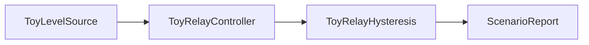
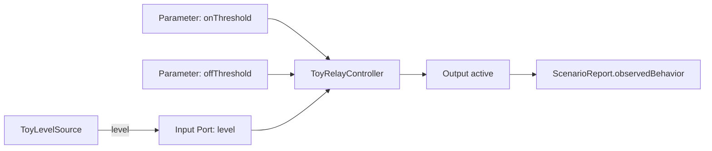
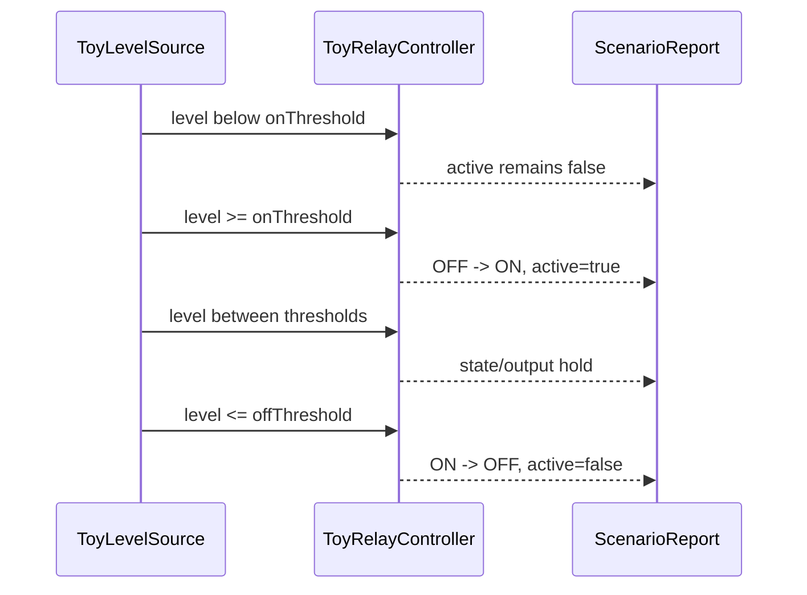
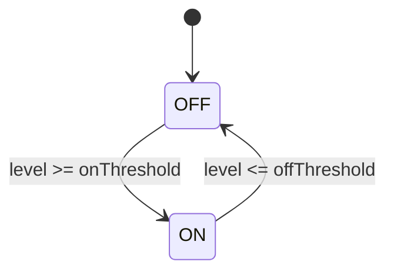

# Simple Relay Hysteresis Specification

This sample is intentionally tiny. It captures a MathWorks-style MBD pattern:
a relay-like controller with two thresholds and state memory. The sample is
fictional and does not describe a real IC, ECU, plant, or product.

## Selection Rationale

MathWorks documents the Simulink Relay block as switching between two outputs
with separate switch-on and switch-off points. When the switch-on point is
greater than the switch-off point, the behavior models hysteresis. MathWorks
also describes state transition tables as a compact way to review sequential
modal logic with states, conditions, actions, and destinations. This sample
uses those public design ideas without copying any real hardware details.

## Intent

- `RLY-001`: When `level` is greater than or equal to `onThreshold` while the
  controller is `OFF`, the controller shall enter `ON` and set `active` true.
- `RLY-002`: When `level` is less than or equal to `offThreshold` while the
  controller is `ON`, the controller shall enter `OFF` and set `active` false.
- `RLY-003`: When `level` is between the two thresholds, the controller shall
  keep its current state and output.
- `RLY-004`: The model shall expose `level`, `onThreshold`, `offThreshold`, and
  `active` as separate reviewable MBD elements.
- `RLY-005`: The preview report shall show model inputs, scenario steps,
  observed behavior, expected behavior, and pass/fail result.

## Boundary

`ToyLevelSource` is a fictional scenario-controlled source. The controller
state is the memory element under review. No physical plant, timing solver,
real register map, production ECU code, or certified code generator is claimed.

## Component View

`ToyLevelSource` supplies fictional scenario stimulus. `ToyRelayController`
owns OFF/ON state memory, threshold guards, and `active` output decisions.
`ToyRelayHysteresis` is the reviewable model boundary. `ScenarioReport`
records observed preview behavior only.

## Data Flow View

The model has one scenario-controlled numeric input, two numeric parameters,
one boolean output, and two states. Hysteresis is represented as explicit
state-dependent transitions rather than a hidden runtime shortcut.

## Sequence View

The sequence view defines reviewable scenario expectations for the Harness
preview. It is not a separate source of control rules.

## Control Semantics View

Trace intent:

- `RLY-001`: `OFF --> ON`, `active=true`
- `RLY-002`: `ON --> OFF`, `active=false`
- `RLY-003`: no transition between thresholds; current state and output hold
- `RLY-004`: input, parameters, state, and output are distinct MBD elements
- `RLY-005`: preview report evidence

## Review Goal

A reviewer should be able to open the generated review artifact and confirm the
behavior in under a minute: one input, two thresholds, two states, two
state-scoped transitions, one output, and one hysteresis scenario.
