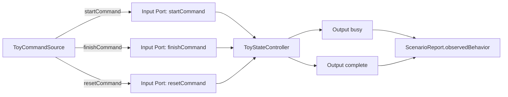
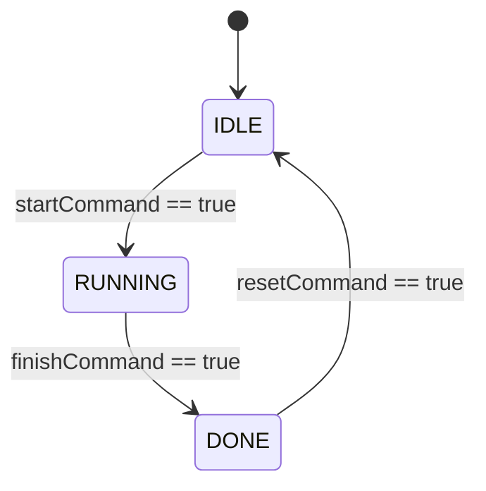

# Simple State Machine Specification

This sample is intentionally tiny. It exists to verify state-machine-centered
MBD review artifacts without thermal-control behavior, real hardware details,
or product-derived logic.

## Intent

- `SM-001`: When `startCommand` is true while the controller is `IDLE`, the
  controller shall enter `RUNNING`, set `busy` to true, and clear `complete`.
- `SM-002`: When `finishCommand` is true while the controller is `RUNNING`, the
  controller shall enter `DONE`, clear `busy`, and set `complete` to true.
- `SM-003`: When `resetCommand` is true while the controller is `DONE`, the
  controller shall enter `IDLE`, clear `busy`, and clear `complete`.
- `SM-004`: The preview report shall show model inputs, scenario steps,
  observed behavior, expected behavior, and pass/fail result.

## Boundary

`ToyCommandSource` is a fictional scenario-controlled source. The sample does
not describe a real IC, datasheet, ECU, register map, company project,
production code, safety case, or certified code generator.

## Design Overview

The model has three scenario-controlled command inputs, two boolean outputs,
and no physical plant. The controller state is the primary behavior under
review.

Trace intent:

- `SM-001`: `IDLE --> RUNNING`, `busy=true`, `complete=false`
- `SM-002`: `RUNNING --> DONE`, `busy=false`, `complete=true`
- `SM-003`: `DONE --> IDLE`, `busy=false`, `complete=false`
- `SM-004`: preview report evidence

## Review Goal

A reviewer should be able to open the generated demo, state handoff artifacts,
or report and understand the complete behavior in under a minute: three inputs,
three states, three state-scoped rules, two outputs, and one full-cycle
scenario.
