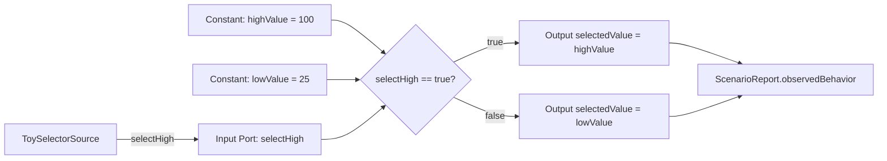

# Simple Switch Selector Specification

This sample is intentionally tiny. It captures a MathWorks/MAB-style modeling
pattern: simple conditional selection should be reviewable as a compare plus a
Switch-style decision, with typed input, parameters, output, and trace.

## Selection Rationale

This sample is based on publicly documented Simulink practice, not on a real
product. MathWorks describes the Switch block as selecting between two data
inputs using a control input, and MAB/MAAB guidance recommends Switch-style
modeling for simple if/else assignments involving constant values. This sample
keeps that idea fictional and minimal.

## Intent

- `SWS-001`: When `selectHigh` is true, the selector shall output `highValue`.
- `SWS-002`: When `selectHigh` is false, the selector shall output `lowValue`.
- `SWS-003`: The model shall expose `selectHigh`, constant values
  `highValue`/`lowValue`, and `selectedValue` as separate reviewable MBD
  elements.
- `SWS-004`: The preview report shall show model inputs, scenario steps,
  observed behavior, expected behavior, and pass/fail result.

## Boundary

`ToySelectorSource` is a fictional scenario-controlled source. The sample does
not describe a real IC, datasheet, ECU, register map, company project,
production code, safety case, or certified code generator.

## Design Overview

Trace intent:

- `SWS-001`: true branch, `selectedValue=highValue`
- `SWS-002`: false branch, `selectedValue=lowValue`
- `SWS-003`: input, constants, and output are distinct MBD elements
- `SWS-004`: preview report evidence

## Review Goal

A reviewer should be able to open the generated review artifact and confirm the
whole model in under a minute: one selector input, two constants, one
decision, two branch actions, one selected output, and one scenario.
