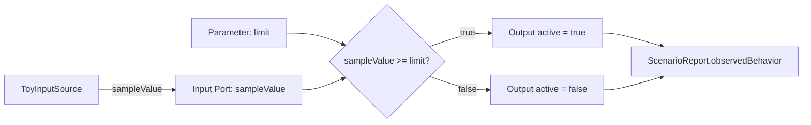
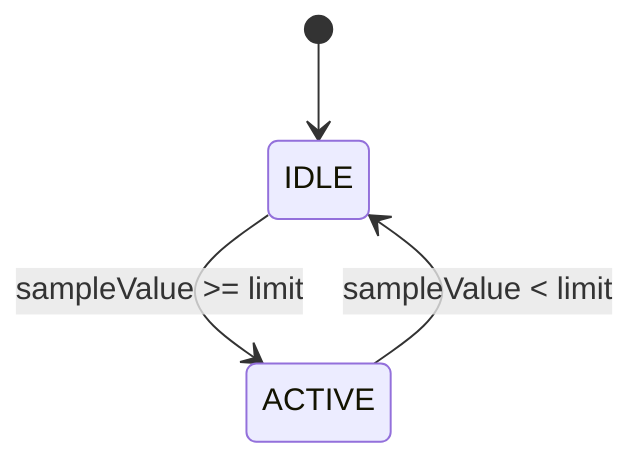

# Simple Threshold Indicator Specification

This sample is intentionally tiny. It exists to verify the sample workspace,
MBD markup, generated handoff artifacts, and preview report flow without using
thermal-control behavior or a product-like IC specification.

## Intent

- `SIMPLE-001`: When `sampleValue` is greater than or equal to `limit`, the
  controller shall set `active` to true and enter `ACTIVE`.
- `SIMPLE-002`: When `sampleValue` is less than `limit`, the controller shall
  set `active` to false and enter `IDLE`.
- `SIMPLE-003`: The preview report shall show model inputs, scenario steps,
  observed behavior, expected behavior, and pass/fail result.

## Boundary

`ToyInputSource` is a fictional scenario-controlled source. It is not a real
sensor, IC, datasheet, register map, or production-derived interface.

## Design Overview

The model has one scenario-controlled input, one threshold parameter, one
boolean output, and no physical plant. The comparison result is the only control
decision.

Trace intent:

- `SIMPLE-001`: `IDLE --> ACTIVE`, `active=true`
- `SIMPLE-002`: `ACTIVE --> IDLE`, `active=false`
- `SIMPLE-003`: preview report evidence

## Review Goal

A reviewer should be able to open the generated demo or report and understand
the complete MBD behavior in under a minute: one input, one parameter, one
output, two states, two rules, and one scenario.
