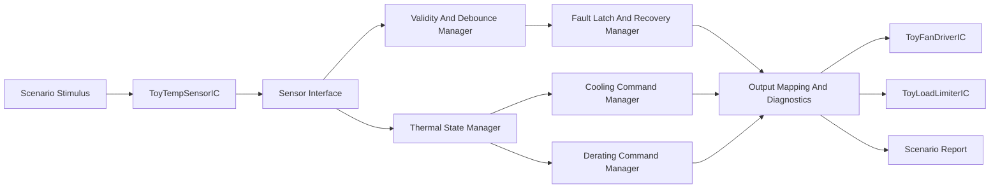
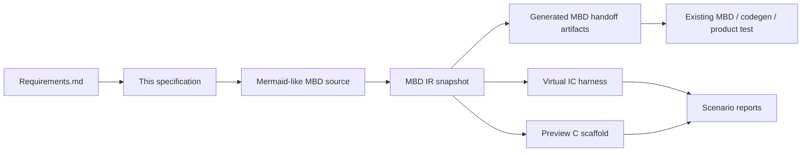
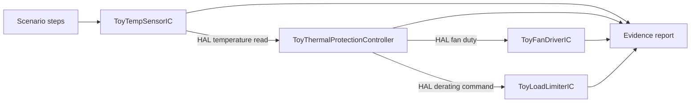

# Toy Thermal Protection Controller Specification

This is an approved-for-demo fictional specification. It is not a real IC
datasheet, production ECU requirement, safety case, or ASPICE compliance claim.

## Demo Review Status

- Behavior approval: **DEMO ASSUMPTION ONLY**
- Source requirement baseline: `Requirements.md`
- Public MBD source: `samples/thermal_protection_controller/model.mbd.md`
- Preview boundary: Python preview and generated C are smoke-test evidence only.
- Production boundary: existing MBD, code-generation, and product-test
  infrastructure remain the intended verification path.

## Demo Assumptions

The following values are invented for the demo so the end-to-end process can be
reviewed. They are not hardware recommendations.

| Name | Value | Trace |
| --- | ---: | --- |
| Low cooling threshold | 68 degC | `SYS-004` |
| High cooling threshold | 78 degC | `SYS-003` |
| Derating entry threshold | 94 degC | `SYS-005` |
| Cooling fan command | 70 percent | `SYS-002`, `SYS-003` |
| Derating fan command | 95 percent | `SYS-002`, `SYS-005` |
| Fictional load limit command | 45 percent | `SYS-005` |
| Sensor invalid safe fan command | 30 percent | `SYS-006` |

`invalidDebounced` is a preview-subset input. It represents "invalid sensor input
persisted beyond the fictional debounce window" without implementing a timing
solver in this repository. External MBD/product-test infrastructure must verify
the real debounce timing if this were a real product.

## System Context

`ToyThermalProtectionSystem` is the fictional system under review. The system
contains a virtual temperature sensor, a thermal protection controller, a
virtual fan driver, a virtual load limiter, and preview-only scenario reports.
The review target is the architecture and control allocation between these
functions, not a real IC datasheet or production ECU module.

## Functional Decomposition

| Function | Responsibility | Owns | Trace | Scenario evidence |
| --- | --- | --- | --- | --- |
| Sensor Interface | Acquire fictional temperature and validity through the HAL boundary. | `temperatureC`, `temperatureValid` | `SYS-001`, `HAR-001`, `HAR-002` | normal, derating, fault latch, recovery |
| Validity And Debounce Manager | Represent sensor invalidity and the preview debounce result without implementing timing physics. | `invalidDebounced` | `SYS-006`, `SYS-007`, `ENG-002`, `HAR-003` | fault latch, recovery |
| Thermal State Manager | Own cooling, idle, and derating state decisions from valid temperature inputs. | `IDLE`, `COOLING`, `DERATING` | `SYS-003`, `SYS-004`, `SYS-005` | normal, boundary, derating |
| Cooling Command Manager | Calculate nominal cooling fan command from thermal state. | `fanDuty` during `COOLING` | `SYS-002`, `SYS-003`, `SYS-004` | normal, boundary |
| Derating Command Manager | Calculate high-temperature fan and fictional load-limit commands. | `deratingCommand` | `SYS-005` | derating |
| Fault Latch And Recovery Manager | Own fault latch, fault hold, and explicit recovery conditions. | `SENSOR_FAULT`, `FAULT_LATCHED`, `recoveryRequest` handling | `SYS-006`, `SYS-007`, `SYS-008` | fault latch, recovery |
| Output Mapping And Diagnostics | Map selected commands to HAL outputs and report-visible diagnostic evidence. | `safeCommandActive`, `diagnosticFault` | `SYS-002`, `SYS-006`, `SYS-009`, `CGEN-003`, `HAR-004` | all preview reports |

## Allocation Rules

- Sensor validity is detected by Sensor Interface and interpreted by Validity
  And Debounce Manager.
- Fault latch and recovery decisions are owned by Fault Latch And Recovery
  Manager. Cooling and derating functions do not override a latched fault.
- Cooling Command Manager and Derating Command Manager calculate normal
  protection commands only when fault management does not select a safe command.
- Output Mapping And Diagnostics is the only function that maps selected
  commands to HAL output calls and report-observable diagnostic signals.
- Scenario reports shall identify which function owns each high-risk behavior
  being checked.

## Process Flow

## Harness Boundary

## Behavior

- `SYS-001`: read fictional temperature and validity through the virtual sensor
  HAL boundary. Owner: Sensor Interface.
- `SYS-002`: command fictional fan duty through the virtual fan driver HAL
  boundary. Owner: Cooling Command Manager and Output Mapping And Diagnostics.
- `SYS-003`: enter `COOLING` and command 70 percent fan duty at or above
  78 degC. Owner: Thermal State Manager and Cooling Command Manager.
- `SYS-004`: return to `IDLE` only at or below 68 degC.
  Owner: Thermal State Manager and Cooling Command Manager.
- `SYS-005`: enter `DERATING`, command 95 percent fan duty, and command a
  fictional 45 percent load limit at or above 94 degC. Owner: Thermal State
  Manager and Derating Command Manager.
- `SYS-006`: enter `SENSOR_FAULT` and command the safe fan duty when temperature
  validity is false. Owner: Validity And Debounce Manager, Fault Latch And
  Recovery Manager, and Output Mapping And Diagnostics.
- `SYS-007`: enter `FAULT_LATCHED` when `invalidDebounced` is true.
  Owner: Fault Latch And Recovery Manager.
- `SYS-008`: recover from `FAULT_LATCHED` only when the sensor is valid,
  `invalidDebounced` is false, and `recoveryRequest` is true. Owner: Fault
  Latch And Recovery Manager.
- `SYS-009`: generate reports for normal cooling, threshold-boundary, derating,
  sensor-invalid, fault-latch, and recovery scenario behavior. Owner: Output
  Mapping And Diagnostics.

## Scenario Evidence

| Scenario | Purpose | Expected result |
| --- | --- | --- |
| `thermal_protection_normal` | Normal high-temperature cooling | `COOLING`, fan duty 70 |
| `thermal_protection_boundary` | Cooling hysteresis return below low threshold | `IDLE`, fan duty 0 |
| `thermal_protection_derating` | High valid temperature protection | `DERATING`, fan duty 95, derating 45 |
| `thermal_protection_fault_latch` | Persistent invalid sensor fault | `FAULT_LATCHED`, safe command active |
| `thermal_protection_recovery` | Explicit recovery from latched fault | `IDLE`, diagnostic clear |
