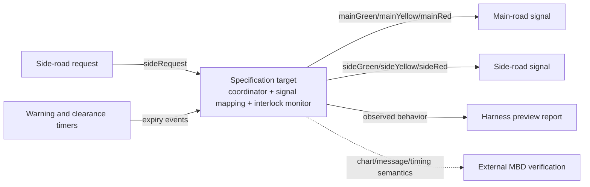
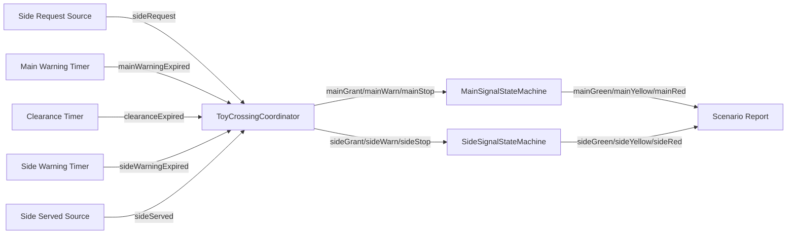
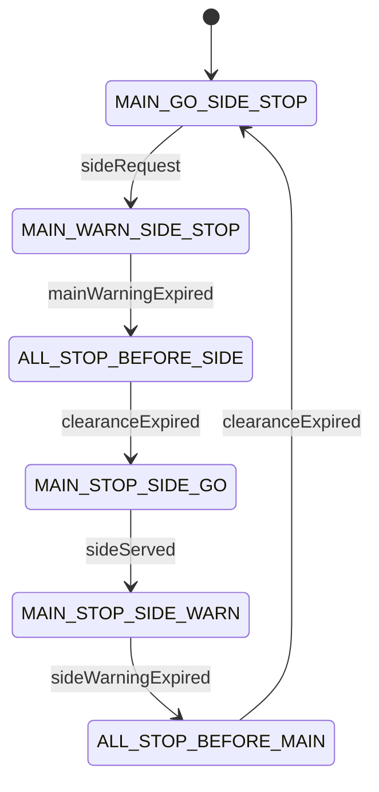

# Side Request Signal Handoff Specification

This synthetic specification describes a fictional main-road / side-road signal
handoff controller. When a side-road request arrives, the controller shall move
the main-road signal through warning and an all-red clearance before granting
the side-road signal. After side service completes, the controller shall return
to the main-road grant through side warning and all-red clearance.

The sample exists to review a multi-component, multi-state-machine MBD handoff
shape. It does not describe a real intersection, IC, ECU, vehicle, traffic
product, certification artifact, or production design.

## Control Context

This specification covers the controller logic inside the highlighted
specification target. Physical signal lamps, traffic flow, real timing, and
production safety mechanisms are outside this sample.

## Specification Component Scope

## Side Request Scenario State Path

This path is the required scenario path for one side-road request cycle. It is
not the complete state space for a real traffic controller.

## Expected Review Points

| Requirement | Reviewer checks |
| --- | --- |
| `DSC-001` | Initial outputs are main green and side red. |
| `DSC-002` | Side request does not immediately grant side green. |
| `DSC-003` | Both directions are red during each clearance mode. |
| `DSC-004` | Side green is only reachable after clearance. |
| `DSC-005` | Return to main grant also passes through side warning and clearance. |
| `DSC-006` | Harness evidence shows no preview step with both green outputs true. |
| `DSC-007` | HTML separates coordinator, main chart role, side chart role, data flow, and harness boundary. |

## Preview Scenario

`side_request_cycle` stimulates a side request, main warning expiry, clearance,
side service completion, side warning expiry, and final clearance. The preview
must end in `MAIN_GO_SIDE_STOP`.
