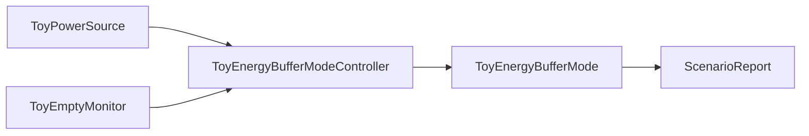
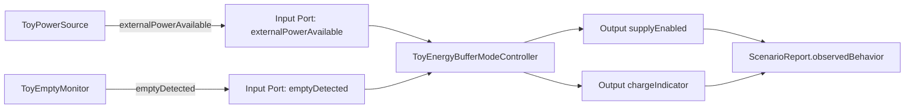
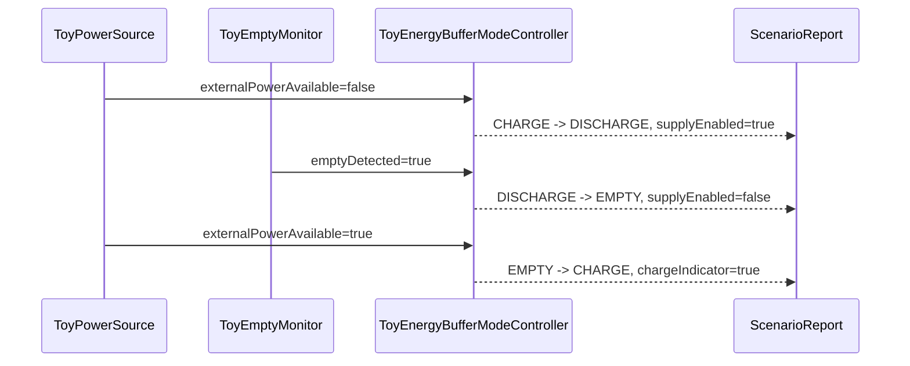
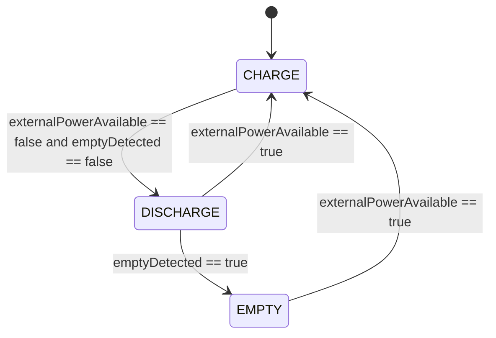

# Toy Energy Buffer Mode Specification

This sample is a fictional, source-informed MBD pattern. It uses public
MathWorks documentation as process inspiration for state transition tables,
operating-mode review, and requirements-based harness assessment, but it does
not describe a real battery, charger, IC, ECU, plant, register map, or product.

## Source-Informed Rationale

- MathWorks Stateflow documentation presents state transition tables as a way
  to model mode logic with states, transitions, conditions, and actions:
  https://www.mathworks.com/help/stateflow/gs/get-started-create-table.html
- MathWorks Stateflow documentation describes states as operating modes of a
  reactive system:
  https://www.mathworks.com/help/stateflow/ug/states.html
- MathWorks Simulink Test documentation describes requirements-based testing
  with a test harness, test sequence, and assessment block:
  https://www.mathworks.com/help/sltest/ug/requirements-based-testing-for-model-development.html
- MathWorks Simulink Test documentation describes nonintrusive harnesses,
  requirements-based assessments, expected outputs, and reports:
  https://www.mathworks.com/help/sltest/getting-started-with-simulink-test.html

This repository translates those public ideas into text-authored, fictional MBD
handoff artifacts and preview-only Harness evidence.

## Intent

- `EBUF-001`: When `externalPowerAvailable` is false and `emptyDetected` is false while the controller is `CHARGE`, the controller shall enter `DISCHARGE`, set `supplyEnabled=true`, and set `chargeIndicator=false`.
- `EBUF-002`: When `emptyDetected` is true while the controller is `DISCHARGE`, the controller shall enter `EMPTY`, set `supplyEnabled=false`, and set `chargeIndicator=false`.
- `EBUF-003`: When `externalPowerAvailable` is true while the controller is `EMPTY`, the controller shall enter `CHARGE`, set `supplyEnabled=false`, and set `chargeIndicator=true`.
- `EBUF-004`: When `externalPowerAvailable` is true while the controller is `DISCHARGE`, the controller shall enter `CHARGE`, set `supplyEnabled=false`, and set `chargeIndicator=true`.
- `EBUF-005`: The model shall expose power availability, empty detection,
  supply command, charge indication, and mode state as separate reviewable MBD
  elements.
- `EBUF-006`: The preview report shall show scenario stimulus, observed
  behavior, expected behavior, Harness boundary evidence, and pass/fail result.

## Boundary

`ToyPowerSource` is a fictional scenario-controlled source. `ToyEmptyMonitor`
is a fictional scenario-controlled mode input. `ToyEnergyBufferModeController`
owns the mode transitions and output decisions. No capacity integration,
electrical behavior, real battery model, production ECU code, certified code
generation, or formal MBD verification is claimed.

## Component View

## Data Flow View

## Sequence View

The sequence view defines Harness preview expectations. It does not add control
rules beyond the Control Semantics View.

## Control Semantics View

Trace intent:

- `EBUF-001`: `CHARGE --> DISCHARGE`, `supplyEnabled=true`, `chargeIndicator=false`
- `EBUF-002`: `DISCHARGE --> EMPTY`, `supplyEnabled=false`, `chargeIndicator=false`
- `EBUF-003`: `EMPTY --> CHARGE`, `supplyEnabled=false`, `chargeIndicator=true`
- `EBUF-004`: `DISCHARGE --> CHARGE`, `supplyEnabled=false`, `chargeIndicator=true`
- `EBUF-005`: inputs, outputs, and states are distinct MBD elements
- `EBUF-006`: preview report evidence

## Review Goal

A reviewer should be able to open the generated review artifact and confirm the
source-informed pattern in about one minute: two fictional inputs, three modes,
four state-scoped transitions, two outputs, one Harness preview scenario, and a
clear boundary between preview evidence and external MBD/product-test
verification.
