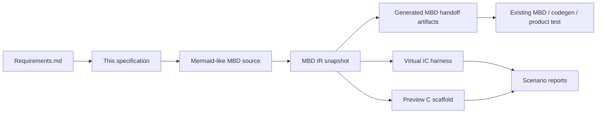
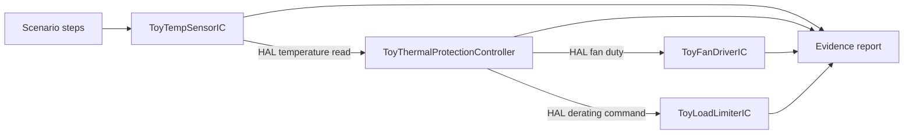

# Toy Thermal Protection Controller Specification

This is an approved-for-demo fictional specification. It is not a real IC
datasheet, production ECU requirement, safety case, or ASPICE compliance claim.

## Demo Review Status

- Behavior approval: **DEMO ASSUMPTION ONLY**
- Source requirement baseline: `Requirements.md`
- Public MBD source: `examples/toy_thermal_protection_controller.mbd.md`
- Preview boundary: Python preview and generated C are smoke-test evidence only.
- Production boundary: existing MBD, code-generation, and product-test
  infrastructure remain the intended verification path.

## Demo Assumptions

The following values are invented for the demo so the end-to-end process can be
reviewed. They are not hardware recommendations.

| Name | Value | Trace |
| --- | ---: | --- |
| Low cooling threshold | 68 degC | `SYS-004` |
| High cooling threshold | 78 degC | `SYS-003` |
| Derating entry threshold | 94 degC | `SYS-005` |
| Cooling fan command | 70 percent | `SYS-002`, `SYS-003` |
| Derating fan command | 95 percent | `SYS-002`, `SYS-005` |
| Fictional load limit command | 45 percent | `SYS-005` |
| Sensor invalid safe fan command | 30 percent | `SYS-006` |

`invalidDebounced` is a preview-subset input. It represents "invalid sensor input
persisted beyond the fictional debounce window" without implementing a timing
solver in this repository. External MBD/product-test infrastructure must verify
the real debounce timing if this were a real product.

## Process Flow

## Harness Boundary

## Behavior

- `SYS-001`: read fictional temperature and validity through the virtual sensor
  HAL boundary.
- `SYS-002`: command fictional fan duty through the virtual fan driver HAL
  boundary.
- `SYS-003`: enter `COOLING` and command 70 percent fan duty at or above
  78 degC.
- `SYS-004`: return to `IDLE` only at or below 68 degC.
- `SYS-005`: enter `DERATING`, command 95 percent fan duty, and command a
  fictional 45 percent load limit at or above 94 degC.
- `SYS-006`: enter `SENSOR_FAULT` and command the safe fan duty when temperature
  validity is false.
- `SYS-007`: enter `FAULT_LATCHED` when `invalidDebounced` is true.
- `SYS-008`: recover from `FAULT_LATCHED` only when the sensor is valid,
  `invalidDebounced` is false, and `recoveryRequest` is true.
- `SYS-009`: generate reports for normal cooling, derating, fault latch, and
  recovery scenarios.

## Scenario Evidence

| Scenario | Purpose | Expected result |
| --- | --- | --- |
| `thermal_protection_normal` | Normal high-temperature cooling | `COOLING`, fan duty 70 |
| `thermal_protection_boundary` | Cooling hysteresis return below low threshold | `IDLE`, fan duty 0 |
| `thermal_protection_derating` | High valid temperature protection | `DERATING`, fan duty 95, derating 45 |
| `thermal_protection_fault_latch` | Persistent invalid sensor fault | `FAULT_LATCHED`, safe command active |
| `thermal_protection_recovery` | Explicit recovery from latched fault | `IDLE`, diagnostic clear |
